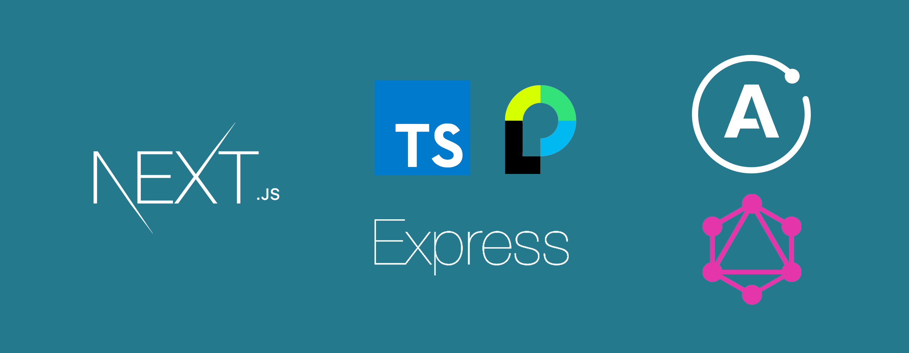

NAME stack (Next, Apollo, Mongo, Express). My current ideal web stack.

# The NAME Stack (because everything deserves a NAME)

The motivation behind this project was illustrated in the following
Medium post.

# Getting started

Clone the [boilerplate](./boilerplate) folter in this repository and then run:

## Install dependencies

```sh
npm i
```

## Run development server

```sh
# Start mongod
docker-compose up

# Start Next server
npm run dev
```

# Ideal stack for web development speed (without compromises)

I have set on the quest of finding the current best web stack (as of mid-2019). This is just my humble opinion given my current knowledge of the field.

**Disclaimer**: I do not intend to get into any dogmatic fights. I just found this stack particularly good, and I thought it'd be worth sharing. If you are more productive in any other language or stack, please use that!

The starting point of any stack decision should be a clear list of requirements it should satisfy. The decision depends on your situation and your company's situation.

## My requirements

- **Developer speed**, because I am a solo founder and the only developer.
- **Quick prototyping**.
- **SSR** (Server side rendering for SEO/SEM support).
- **SPA**: Single page application to create great experiences.
- **Cheap and open source**: because the project will most likely die anyway.

## A bit of history

Up until a few years ago, my favorite tools for bootstrapping a new MVP were [Meteor](https://www.meteor.com/) and [Create React App](https://github.com/facebook/create-react-app). However, I am quite disappointed with the current situation with Meteor, as I think there are some big changes due to the platform to make it great again.

My highest priority is development speed because I want to move forward quickly.

## The NAME stack (because everything deserves a NAME)

After some research and experimentation, I have settled with:

- [NextJS](https://nextjs.org/): Awesome support for SSR (which is a requirement if you want to optimize SEO/SEM). Quite opinionated, but still flexible.
- [Apollo](https://www.apollographql.com/) ([GraphQL](https://graphql.org/)): I use [Apollo Server](https://github.com/apollographql/apollo-server) and [Apollo Client](https://github.com/apollographql/apollo-client) to expose all the data my application needs. Check out [with-apollo](https://github.com/zeit/next.js/tree/canary/examples/with-apollo) Next example for Apollo Client integration.
- [MongoDB](https://www.mongodb.com/): For the data layer, I chose [MongoDB](https://www.mongodb.com/) (NoSQL) because it is easier to get started with, at the expense of potentially having to deal with some data inconsistencies if the application survives long enough (migrations, associative tables, strict schema, etc). [Mongoose](https://mongoosejs.com/) library is quite powerful and allows some great schema configurations. An alternative was using an ORM like Prisma, but I decided to stick with [MongoDB](https://www.mongodb.com/) for being more mature and flexible than these new ORMs.
- [Express](https://expressjs.com/): NextJS gives you the possibility to use a custom [Express](https://expressjs.com/) server ([check out the example](https://github.com/zeit/next.js/tree/canary/examples/custom-server-express)). You can then expose an API along with the web application routes, directly using the one [express](https://expressjs.com/) server. I exposed a REST API for the user management with [PassportJS](http://www.passportjs.org/), a GraphQL API endpoint, and the standard Next routes.
- [TypeScript](https://www.typescriptlang.org/): It may slow you down a bit, but it is worth the extra safety it provides.
- Deployment: [Dokku](https://github.com/dokku/dokku). Open-source Docker-based PaaS. For just \$10 you can set up your own Heroku-like PaaS in a droplet, and incubate all your side projects until one generates any money. Then you could transition to a more scalable solution if you need to.
- Headless CMS: This is an improvement I am considering if I ever have to create a project that needs to be maintained by non-technical people. [Strapi](https://strapi.io/) is a great open-source headless CMS, and it could accelerate development because you would spend less time writing APIs and CMS like functionality into your app.

## User management

I chose to use an Authentication as a Service provider. Concretely, I chose Firebase
for the following reasons:

- Free (for now at least)
- Sends messages to verify email and reset password
- Centralized and I could use it easily in other services
- JWT, refresh token and sessions integrated
- Allows custom claims in the JWT (e.g adding role to user)

### Using PassportJS and custom User model

Check out the code at [docs/using-passportjs](./docs/using-passportjs). That folder
includes some of the implementation for PassportJS and a custom User model.

You might need to adapt this code to make it work, but it should serve as a good reference
point on implementing such thing in NextJS.

## What could be improved?

- Simple getting started tools. My reference is Meteor, because I think they did a great job decrease time to launch and prototyping. However, at the time of writing the NAME stack requires quite a bit of configuration.
- User and session management. Having to deal with passwords and sessions seems like a hurdle that no small company should have to deal with. It is a time-wasting and error-prone repetitive task that every company needs. [PassportJS](http://www.passportjs.org/) is fine, but I miss a stronger integration like the Accounts UI from Meteor. The project [AccountsJS](https://github.com/accounts-js/accounts) looks promising though, but it still requires some work. A service like Auth0 could be fine, but it becomes expensive quite quickly, and I am cheap while my projects generate \$0.
- Glue and more glue: NextJS + Apollo + Mongo + [Express](https://expressjs.com/) + GraphQL + [PassportJS](http://www.passportjs.org/). It is quite annoying and frustrating spending time gluing tools together. But the worst is to realize that after an entire day of work, you didn't get any actual business logic done, only glued pieces together that you wished were glued out of the box for you. It has another important downside, and it is that it increases the moving parts. The more moving parts, the easier is that it breaks and the harder to maintain for a small company. Again, I'd prefer a unified solution like Meteor.

## But, is there anything good?

There are many positive aspects to this stack, and I'll name a few:

- Development speed is great because Next is a glorified create-react-app. GraphQL is also quite fun and fast to work with.
- Good performance. A server-side rendered site would never be as fast as a pre-rendered static CDN hosted site. However, server-side rendered is way superior to Single Page Applications (SPA), because the client gets immediately the HTML for the site, and it can display and download assets while the full JS bundle loads. For most applications, the stock webserver is sufficient. If you happen to have enough traffic to hit the bottlenecks, you probably have enough resources to invest in a more scalable solution.
- The technologies are already quite mature, and the community is thriving. It is very easy to find good examples around the web for all the technologies I used.
- Way more flexible than Meteor, and would make it simple to swap one component when a new technology comes in. Although, most side projects fail quite before they require a major technology bump. Therefore, time to market is still the most important thing.

# Feedback, pleaaase 🥺

What are your thoughts about this stack? Any improvements you would suggest?

# Contributing

Please, contributions are more than welcome. We can all build a great
boilerplate project that would accelerate time to market for many applications!

# LICENSE

MIT
